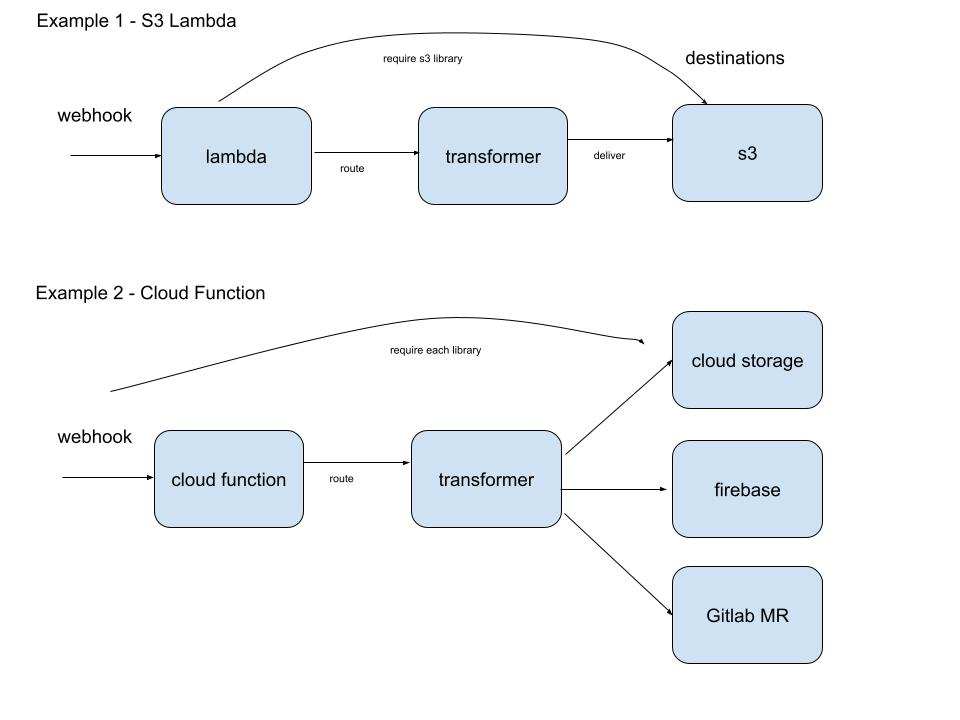

= FeatureHub Webhook Utility Package

This package is designed to give you utilities which allow you to transform the incoming
webhook from FeatureHub into a message format, that can be used by one of the FeatureHub SDKs, and to allow to store the message at a destination (e.g. S3 bucket). Primary use case for this is caching features outside FeatureHub server, for example in AWS S3 storage or Cloud Storage.

There are two types of webhooks that FeatureHub produces:

- The "Standard Webhook" contains a full set of all the features for an individual environment. 
- The "Messaging Webhook" which contains a difference message, essentially an audit entry indicating what changes were made and by whom. 

This package uses the first type - "Standard Webhook"

== The "Standard Webhook"

It is designed to be triggered off and be a "full detail" message of an environment's feature state. Use cases for this are:

* if you have a lambda or cloud function that can more easily get its state from a bucket (s3, cloud storage) then you can push the webhook there,
so your FeatureHub SDK can grab it from the bucket. Such technique can be used to achieve high availability of FeatureHub service, to guarantee latest feature state can always be retrieved from the storage in the case of when FeatureHub service goes down and becomes unavailable.
* push the data into your own Cloud Cache vendor in a custom fashion for your browser or mobile devices to pick up
* if you have PHP servers that store their data in a memcache, you could push it into the memcache
* trigger a downstream CI automation such as rebuilding a static website
* accumulate and merge multiple environments, applications or portfolios together to form one large data set
* push data into a timebase tracking or data logging solution

== Package Documentation

The package is split into the link:https://github.com/featurehub-io/featurehub-webhook-to-sdk/tree/docs-patch1/featurehub-webhook-utils[core library] and the link:https://github.com/featurehub-io/featurehub-webhook-to-sdk/tree/docs-patch1/destinations[destination libraries] (converters). You can also find examples link:https://github.com/featurehub-io/featurehub-webhook-to-sdk/tree/docs-patch1/examples[here].

The core library is designed to take an incoming webhook (in string or json body form) and
transform it into a fully structured SDK json file which can be loaded into any of the
FeatureHub SDKs without the need to use any of the existing clients - so it does not
require FeatureHub to be accessible or available to your application.

An example of a request to be processed:

[source,js]
----
await (new DestinationConfig()).route(bodyContainingPayload)
----

This request can come from a web request, or any other event, as long as it contains the payload.

The `DestinationConfig()` is a *registry* - when created (as above with the `new DestinationConfig()`) it will look for an environment variable called `DESTINATIONS`, which needs to be a comma separated list of arbitrary names.

These arbitrary names represent the converters that the sdk body will be passed to -
for example you could have `DESTINATIONS=bucket,dynamo` - indicating when the webhook comes in, you want to pass that
sdk data to some definition of a bucket and a DynamoDB configuration (note the names are arbitrary, they could
be `DESTINATIONS=amelia,radcliffe` for instance - but its ideal to keep them meaningful).

For each of these arbitrary names, it will look for `DESTINATION_x_TYPE`, which determines the converter it should use. Register
the converters you wish to use by simply adding them as dependencies to the application that receives the webhook and
`require`_ing_ them.

Essentially your webhook receiver becomes a *composed* artifact that receives the webhook, authenticates it and then passes it along to the destinations
for appropriate use. 

===== Lambda function example

A lambda function which writes the messages to an s3 bucket, so something downstream can consume it, could look as follows:
In this case, use `DESTINATIONS=s3`,
the `s3` transformer registers a `DESTINATION_S3_TYPE=s3` automatically, so you don't need to do anything else to define it. 
To define a bucket: `DESTINATION_S3_BUCKET=featurehub-sdk`.

[source,js]
----
const {DestinationConfig} = require("featurehub-webhook-utils");

// load and register s3 type
require('featurehub-webhook-aws');

// this is a standard lambda format for nodejs
exports.handler = async (event, context) => {
  console.log("EVENT: \n" + JSON.stringify(event, null, 2));
  try {
    await (new DestinationConfig()).route(event.body);
    return 200;
  } catch (e) {
    console.error("failed to process", e);
    return 500;
  }
}
----

Example of writing to multiple s3 buckets, e.g `bucket1` and `bucket2` and write in `bucket2` to the folder `features`:

[source,shell]
----
DESTINATIONS=s1,s2
DESTINATION_S1_TYPE=s3
DESTINATION_S1_BUCKET=bucket1
DESTINATION_S2_TYPE=s3
DESTINATION_S2_BUCKET=bucket2
DESTINATION_S2_FOLDER=features
----

No code needs to be changed unless you want to support extra destination types.

== Developer docs - Creating your own destination types

Feel free to create a PR into this repository with your own destination types converters that you think would be useful for the community.

=== Registration

On load, destination should register themselves in the `DestinationConfig` registry. 

[source,typescript]
----
import {DestinationConfig, SdkAction} from "featurehub-webhook-utils";

DestinationConfig.register('YourType', (code) => new YourClass(code));
----

A `code` above just allows you to use a `key('field_name')` that gives you a way to extract environment variables based on your type,
e.g. the s3 one uses `code.key('folder')` and `code.key('bucket`)`. It always converts it to upper case - so looks for DESTINATION_<code>_<key>.

=== Payload

Your class must implement at least the DestinationPayload interface (if in javascript it just 
needs to implement the method with the right signature) which is: 

[source,typescript]
----
export interface DestinationPayload {
  deliver(sdkPayload: SdkPayload): Promise<void>;
}
----

The SdkPayload has three standard fields:

[source,typescript]
----
environmentId: string;
sdkPayload: Array<FeatureState> | undefined;
action: SdkAction;
----

The action indicates what kind of payload it was - (0) - it was an empty payload so should be ignored, this can happen on environment
creation. (1) is a "delete" which means the environment was being deleted, (2) means it is being created or updated. The `sdkPayload` for (2)
is always the complete set of features. The `environmentId` is that which matches the first part of the API Key - which is `{environmentId/sdkApiKey}`.

